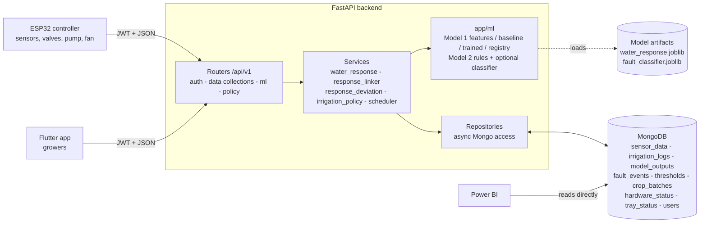
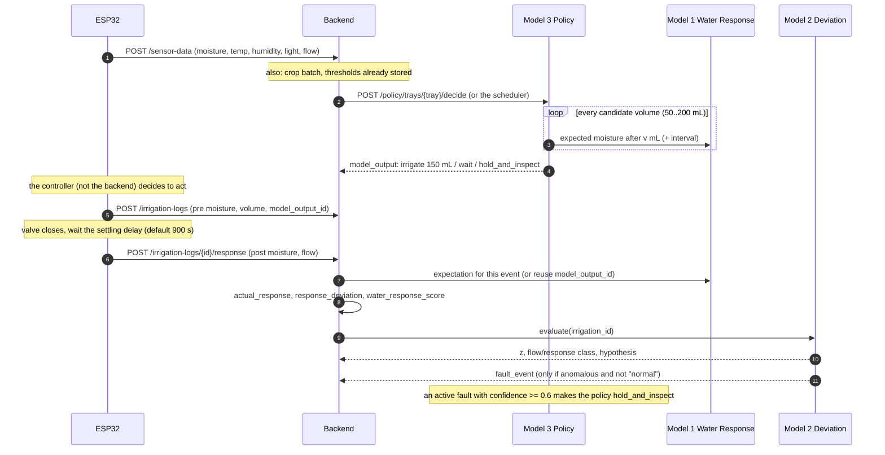
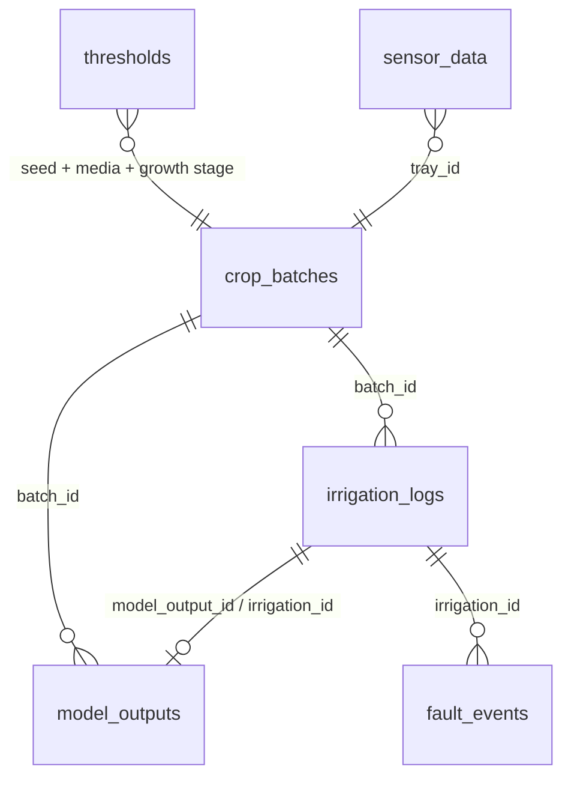

# SmartGrow AI — Backend

FastAPI + MongoDB backend for the SmartGrow AI microgreen cultivation platform. It stores what the ESP32 senses and
does (sensor readings, hardware state, irrigation events, faults, crop batches, thresholds) and closes the irrigation
loop with three models:

| Model | Question it answers | Version shipped |
|---|---|---|
| **1 — Crop-Water Response** | "If I give this tray *X* mL, how wet will the media be afterwards?" | `baseline-v0` (transparent formula) → `gbr-q-<date>` once you train it |
| **2 — Response-Deviation / Fault** | "Did the tray respond as expected? If not, why?" | `rules-v0` (flow + response rules) → optional learned classifier |
| **3 — Adaptive Irrigation Policy** | "Should I irrigate this tray now, and with how much?" | `policy-v0` (recommendations only) |

> This README is the single reference for the architecture, what is implemented, and every endpoint with its fields.
> Interactive docs: **Swagger** at `/docs`, ReDoc at `/redoc`, Postman collection in `postman/`.

---

## Contents

1. [System architecture](#1-system-architecture)
2. [What is implemented (and what is not)](#2-what-is-implemented-and-what-is-not)
3. [Project layout](#3-project-layout)
4. [Conventions: units, ids, timestamps, optional fields](#4-conventions)
5. [Endpoint reference](#5-endpoint-reference)
6. [How the models work](#6-how-the-models-work)
7. [End-to-end walk-through](#7-end-to-end-walk-through)
8. [Training the models](#8-training-the-models)
9. [Configuration](#9-configuration)
10. [Running, testing, Postman, Swagger](#10-running-testing-postman-swagger)
11. [Power BI dashboard](#11-power-bi-dashboard)
12. [Assumptions, limitations, security notes](#12-assumptions-limitations-security-notes)

---

## 1. System architecture

### 1.1 Big picture



Layers (each folder under `app/` has one job):

| Layer | Folder | Responsibility |
|---|---|---|
| Routers | `app/api/v1/` | HTTP, validation, auth guard, Swagger text. No business logic. |
| Dependencies | `app/api/deps.py` | Builds repositories/services per request; `get_current_user` enforces the JWT. |
| Services | `app/services/` | Business logic: gathering tray context, calling models, linking results, creating faults, deciding irrigation. |
| ML | `app/ml/` | Pure model code (features, baseline, trained model, rules). No database access. |
| Repositories | `app/repositories/` | One class per Mongo collection; shared helpers in `base.py`. |
| Models | `app/models/` | Pydantic request/response schemas (every field documents its unit). |
| Core | `app/core/` | Settings, Mongo client + startup indexes, security, rate limit, exceptions. |

### 1.2 The closed irrigation loop



Data flow in one sentence: **ESP32 → sensor data → Model 3 asks Model 1 → recommendation → irrigation → measured response →
Model 2 compares with Model 1 → fault events feed back into Model 3's fault gate**; thresholds bound the policy's target band.

### 1.3 Collections and how they link



Business ids (`batch_id`, `irrigation_id`, `output_id`, `fault_id`, …) are generated UUID hex strings. **They — not Mongo `_id` — are
what you link with.**

---

## 2. What is implemented (and what is not)

### Implemented

| Area | What |
|---|---|
| Auth | Register, login, refresh, logout, current user (JWT, refresh-token denylist, rate-limited login). Unchanged. |
| Data collections | 8 insert-only endpoints: `sensor_data`, `model_outputs`, `hardware_status`, `tray_status`, `thresholds`, `irrigation_logs`, `crop_batches`, `fault_events`. |
| **Model 1** | Feature builder (as-of-event, no future data), transparent `baseline-v0`, quantile gradient-boosting model `gbr-q-<date>`, registry (trained artifact if present, else baseline), confidence from the prediction interval, grouped-split training script, prediction endpoint. |
| **Response linking** | `POST /irrigation-logs/{id}/response`: stores the post-irrigation moisture, computes actual response and deviation, updates the linked model output, runs Model 2. |
| **Model 2** | Stage A deviation score (z) normalised by Model 1's interval; Stage B flow/response classification into a fault hypothesis (`rules-v0`); fault event creation; resolve endpoint; hook for a learned classifier trained on injected faults. |
| **Model 3** | Fault gate, hard limits (min interval, daily volume), interim linear drying forecast, candidate-volume simulation through Model 1, threshold-band selection, optional exploration, optional background scheduler. Recommendations only. |
| Platform | Timestamps stored as UTC BSON datetimes; indexes created at startup; all schema additions optional; units in every field description; Swagger tags and examples; Postman collection kept in sync with the routes. |

### Not implemented (out of scope)

- Device-to-backend authentication changes (the ESP32 uses a normal JWT login) and any **command/actuation channel** to the ESP32 —
  the policy only *records* what it recommends.
- Firmware and Flutter UI for these models.
- A growth and harvest prediction model.
- Reinforcement learning or online retraining.

---

## 3. Project layout

```
app/
  core/          config, Mongo client + startup indexes, security, rate limiting, exceptions
  models/        Pydantic schemas (enums.py = shared enums, ml.py = ML request/result schemas)
  repositories/  one class per collection; base.py has the business-id / time-window helpers
  services/      auth, water_response, response_linker, response_deviation, irrigation_policy, scheduler
  api/v1/        routers: auth, sensor_data, model_output, hardware_status, tray_status, threshold,
                 irrigation_log, crop_batch, fault_event, ml, policy (+ insert.py shared insert helper)
  ml/
    water_response/     features.py, baseline.py, trained.py, registry.py, prediction.py, scoring.py
    response_deviation/ rules.py (Stage B rules + learned-classifier hook)
tests/           pytest suite (152 tests, in-memory Mongo)
postman/         importable collection + environment
scripts/         train_water_response.py, train_fault_classifier.py, sync_postman_collection.py,
                 seed_demo_data.py, demo_data.py, build_powerbi_dashboard.py, SmartGrow.pbip (Power BI project) + helpers
.github/workflows/   postman-sync.yml (keeps the Postman collection in sync with the routes)
```

---

## 4. Conventions

**Units (fixed, and repeated in every field description in Swagger)**

| Quantity | Unit |
|---|---|
| Moisture | **% volumetric water content (0–100)**, already calibrated — never raw ADC |
| Moisture change / deviation / tolerance | % points |
| Water volume, water consumed | **mL** |
| Flow rate | **L/min** |
| Durations, delays | **seconds** (policy intervals are in minutes where the name says `_minutes`) |
| Temperature | °C |
| Humidity | % RH |
| Light | lux |

**Timestamps** — all in UTC. A naive client datetime is treated as UTC; an offset datetime is converted. `timestamp`,
`created_at`, `resolved_at`, `effective_from` and `updated_at` are stored as timezone-aware UTC BSON datetimes and returned
as ISO-8601 strings. Calendar dates (`planting_date`, …) are `YYYY-MM-DD`.

**Insert-only** — data collections are only ever inserted through `POST`. The only updates are the two explicit ones:
`POST /irrigation-logs/{id}/response` and `PATCH /fault-events/{id}/resolve`.

**Optional fields** — every field added for the models is optional, so existing clients keep working. Required fields are marked
**req** below.

**Auth** — every endpoint except `/health` and `/auth/register|login|refresh|logout` needs `Authorization: Bearer <access_token>`;
without it the API returns `401`.

**Error codes used** — `401` no/invalid token, `404` unknown id / no data, `409` conflict, `422` invalid body or not enough data to compute.

---

## 5. Endpoint reference

All paths are under `/api/v1` unless noted. Every endpoint below is visible in Swagger and the Postman collection.

### 5.1 Health

| Method | Path | Auth | Purpose |
|---|---|---|---|
| GET | `/health` (no prefix) | no | Liveness probe: `{status, app, environment}`. |

### 5.2 Auth

| Method | Path | Body | Returns | Purpose |
|---|---|---|---|---|
| POST | `/auth/register` | `email` (req), `password` 8–128 (req), `full_name` (req), `role` = `admin`/`grower`/`viewer` (default `grower`) | the user (`id`, `email`, `full_name`, `role`, `is_active`) | Create an account. `409` if the email exists. |
| POST | `/auth/login` | `email`, `password` | `access_token` (30 min), `refresh_token` (7 days), `token_type` | Log in. Rate limited (`RATE_LIMIT_LOGIN`, default 5/min). |
| POST | `/auth/refresh` | `refresh_token` | new `access_token` | Renew the access token. |
| POST | `/auth/logout` | `refresh_token` | `204` | Revoke the refresh token server-side. |
| GET | `/auth/me` | — | the current user | Check a token / show the profile. |

### 5.3 Data collections (insert-only)

Each `POST` validates the body, adds the generated id and `created_at`, stores one document and returns it. Used by: the
ESP32/gateway for live data, the app for manual entries, and the models themselves.

#### `POST /sensor-data` → `sensor_data` · id `sensor_data_id`
One ESP32 reading for a tray. Models 1 and 3 read the **latest reading per tray**.

| Field | Type | Unit / meaning |
|---|---|---|
| `timestamp` | datetime | When the reading was taken (UTC); default now |
| `esp32_id` **req** | string | Controller that produced it |
| `tray_id` **req** | string | Tray |
| `seed_type`, `media_type` | string | What is grown / growing media (fallback when no crop batch) |
| `temperature` | float | °C |
| `humidity` | float | % RH |
| `soil_moisture` | float | % VWC (0–100), calibrated |
| `light_intensity` | float | lux |
| `water_level` | float | reservoir level (recommended % of tank) |
| `water_flow_rate` | float | L/min |

#### `POST /model-outputs` → `model_outputs` · id `output_id`
One result of any model. Models 1–3 write their own rows; use this endpoint for results computed elsewhere (e.g. on-device TinyML).

| Field | Type | Unit / meaning |
|---|---|---|
| `timestamp`, `tray_id` **req**, `model_name` **req**, `model_version` | | `crop_water_response` / `response_deviation` / `adaptive_irrigation_policy` / yours |
| `growth_prediction`, `stress_probability` (0–1), `anomaly_score`, `sensor_health_score` (0–1) | | generic model outputs |
| `predicted_soil_moisture` | float | % VWC (Model 1 stores the expected post-irrigation value here) |
| `predicted_harvest_date`, `predicted_yield` | date, float | growth model outputs |
| `irrigation_recommendation`, `recommended_action`, `recommendation_confidence` (0–1), `recommendation_reason` | | Model 3: `irrigate`/`wait`/`hold_and_inspect`, action text, confidence, semicolon-separated reason codes |
| **`batch_id`** | string | linked crop batch |
| **`irrigation_id`** | string | linked irrigation event, once known |
| **`growth_stage`** | enum | `germination`, `blackout`, `early_growth`, `active_growth`, `pre_harvest` |
| **`input_features`** | object | the exact feature vector used (reproducibility) |
| **`expected_moisture_change`** | float | median change, % points |
| **`expected_moisture_after_irrigation`** | float 0–100 | median post-irrigation moisture, % VWC |
| **`expected_moisture_lower` / `_upper`** | float 0–100 | 10th / 90th percentile bounds, % VWC |
| **`actual_moisture_after_irrigation`** | float 0–100 | filled when the response is linked |
| **`response_error`** | float | actual − expected moisture after irrigation, % points |
| **`response_confidence`** | float 0–1 | Model 1 confidence |
| **`water_response_score`** | float 0–1 | how well actual matched expected |
| **`decision_volume_ml`** | float ≥ 0 | volume chosen by Model 3, mL |
| **`candidate_evaluations`** | list of objects | Model 3: per candidate volume — expected after / lower / upper, accepted, reason |

(**bold** = added for Models 1–3.)

#### `POST /hardware-status` → `hardware_status` · id `hardware_status_id`
Actuator/link health for fault monitoring.

| Field | Meaning |
|---|---|
| `timestamp`, `esp32_id` **req** | when / which controller |
| `overall_system_status` | e.g. ok / degraded / fault |
| `solenoid_1_status`, `solenoid_2_status`, `solenoid_3_status` | valve states |
| `fan_status`, `motor_status`, `water_pump_status` | actuator states |
| `power_status`, `connectivity_status` | supply and network state |

#### `POST /tray-status` → `tray_status` · id `tray_status_id`
Snapshot of trays 1–3 for crop-management dashboards.

| Field | Meaning |
|---|---|
| `timestamp` | when |
| `tray_1_status`, `tray_2_status`, `tray_3_status` | e.g. active / empty / harvested |
| `tray_N_seed_type`, `tray_N_media_type` (N = 1..3) | what is in each tray |

#### `POST /thresholds` → `thresholds` · id `threshold_id`
Optimal/warning/critical range of one parameter for a seed + media + growth stage. **Model 3 reads the latest effective `parameter = soil_moisture` row.** Change a range by inserting a new row with a later `effective_from`.

| Field | Meaning |
|---|---|
| `seed_type`, `media_type`, `growth_stage`, `parameter` **req** | what the range applies to |
| `optimal_min`, `optimal_max` | optimal band (parameter unit; % VWC for `soil_moisture`) |
| `warning_min`, `warning_max`, `critical_min`, `critical_max` | warning / critical bounds |
| `threshold_version`, `effective_from` | version label; when the row starts to apply (UTC) |
| *(server)* `updated_at` | when stored |

#### `POST /irrigation-logs` → `irrigation_logs` · id `irrigation_id`
One irrigation event, plus its measured moisture response.

| Field | Type | Unit / meaning |
|---|---|---|
| `timestamp` | datetime | when irrigation started (UTC) |
| `tray_id` **req** | string | tray |
| `solenoid_id`, `pump_status` | string | valve / pump used |
| `irrigation_duration` | float | seconds |
| `water_consumed` | float | mL (legacy; prefer `water_volume`) |
| `trigger_type`, `trigger_reason`, `ai_recommended`, `actual_action` | | why/how it started |
| **`batch_id`** | string | crop batch |
| **`model_output_id`** | string | `output_id` of the Model 3 decision / Model 1 prediction behind it |
| **`growth_stage`** | enum | stage at irrigation time |
| **`pre_irrigation_moisture`** | float 0–100 | % VWC just before irrigation |
| **`post_irrigation_moisture`** | float 0–100 | % VWC `post_measured_after_s` seconds after the valve closed |
| **`post_measured_after_s`** | int ≥ 0 | settling delay, seconds |
| **`water_volume`** | float ≥ 0 | measured volume delivered, mL (flow-pulse counting) |
| **`avg_flow_rate`** | float ≥ 0 | mean flow during the event, L/min |
| **`flow_cv`** | float ≥ 0 | coefficient of variation of flow (intermittency), unitless |
| **`expected_response`** | float | Model 1 expected change, % points — *set by the response endpoint* |
| **`actual_response`** | float | `post − pre`, % points — *server-computed* |
| **`response_deviation`** | float | `actual − expected`, % points — *server-computed* |

#### `POST /crop-batches` → `crop_batches` · id `batch_id`
One planted batch. The growth stage is derived from the days after `planting_date`; a batch without `harvest_date` is the tray's active batch.

| Field | Meaning |
|---|---|
| `seed_type`, `media_type`, `tray_id` **req** | what / where |
| `planting_date` **req** | `YYYY-MM-DD` |
| `expected_harvest_date`, `harvest_date` | planned / actual (`YYYY-MM-DD`) |
| `seed_quantity`, `batch_status` | amount sown; e.g. planted / growing / harvested / failed |

#### `POST /fault-events` → `fault_events` · id `fault_id`
A detected fault and what was done about it. Model 2 creates `response_anomaly` events; use this endpoint for faults detected elsewhere (ESP32 thresholds/TinyML) and for **labelled fault-injection experiments** (`injected = true`).

| Field | Meaning |
|---|---|
| `timestamp`, `esp32_id` **req**, `tray_id`, `fault_type` **req**, `fault_source`, `severity` **req** | when / who / what / `sensor`·`pump`·`valve`·`fan`·`power`·`communication` / `warning`·`critical` |
| `sensor_value`, `expected_min`, `expected_max` | value that triggered detection and the expected limits (same unit) |
| `anomaly_score`, `fault_probability` (0–1), `detected_by` | score, probability, `threshold`/`tinyml`/`rule`/`model` |
| `recommended_action`, `automatic_action` | what should happen / what the system did |
| `fault_status` (default `active`), `resolved_at`, `resolution_reason` | lifecycle |
| **`irrigation_id`** | irrigation event that triggered the evaluation |
| **`response_deviation`** | % points that triggered it |
| **`fault_hypothesis`** | `pump_tank_blockage`, `distribution_sensor_media`, `leakage_or_sensor`, `valve_tubing_system`, `normal`, `unknown` |
| **`fault_confidence`** | 0–1 |
| **`flow_class`** | `no_flow`, `normal`, `intermittent` |
| **`response_class`** | `no_change`, `below_expected`, `expected`, `excessive` |
| **`diagnostic_action`**, **`recovery_action`**, **`recovery_success`** | what the grower should check / recovery step / outcome |
| **`injected`** | default `false`; `true` for deliberate experiments (training labels) |

### 5.4 Model 1 — Crop-Water Response

#### `POST /ml/water-response/predict`
Predicts the moisture after irrigating `water_volume` mL and **stores the result** as a `model_outputs` row (`model_name = crop_water_response`). Returns that row (`201`).

| Request field | Meaning |
|---|---|
| `tray_id` **req** | tray (also a learned feature: each tray gets its own offset) |
| `water_volume` **req** | planned volume, mL |
| `batch_id` | defaults to the tray's active batch |
| `seed_type`, `media_type`, `growth_stage` | override the batch / derived stage |
| `pre_irrigation_moisture` | % VWC; defaults to the tray's latest sensor reading |
| `temperature`, `humidity`, `light_intensity` | default to the latest reading |
| `timestamp` | event time (UTC); features are built as of this time; default now |

Response highlights: `expected_moisture_after_irrigation`, `expected_moisture_lower/upper`, `expected_moisture_change`, `response_confidence`,
`model_version`, `input_features`. Errors: `422` if no moisture can be determined; `404` for an unknown `batch_id`.

### 5.5 Response linking and Model 2 — Response-Deviation / Fault

#### `POST /irrigation-logs/{irrigation_id}/response`
Records the **measured result** of an irrigation event and runs the whole Model 1 → Model 2 chain. Returns `{irrigation_log, model_output, deviation}`.

| Request field | Meaning |
|---|---|
| `post_irrigation_moisture` **req** | % VWC (0–100) measured after the settling delay |
| `post_measured_after_s` | settling delay used, seconds (default `DEFAULT_POST_MEASURE_DELAY_S`) |
| `avg_flow_rate` | L/min |
| `flow_cv` | flow coefficient of variation |
| `water_volume` | measured volume, mL |

What the server does: stores the post reading → `actual_response = post − pre` → takes the expectation from the linked `model_output_id`
(or calls Model 1 now and stores the new id on the log) → sets `expected_response` and `response_deviation` → updates the linked model output
(`irrigation_id`, `actual_moisture_after_irrigation`, `response_error`, `water_response_score`) → runs Model 2.
Errors: `404` unknown `irrigation_id`; `422` if the log has no `pre_irrigation_moisture` (or no volume to predict with).
**This is the only update path on `irrigation_logs` and `model_outputs`.**

#### `POST /ml/response-deviation/evaluate`
Re-runs Model 2 for an event whose response is already linked. Body: `{irrigation_id}`. Returns:

| Response field | Meaning |
|---|---|
| `response_deviation`, `half_interval`, `z` | % points, % points, unitless |
| `is_anomaly`, `severity` | `|z| > 1.0`; `critical` if `|z| > 2.5`, else `warning` |
| `flow_class`, `response_class` | classified patterns |
| `fault_hypothesis`, `fault_confidence`, `detected_by` | cause, 0–1, `rule` or `model` |
| `diagnostic_action`, `recovery_action` | what to check / what to do |
| `fault_event` | the created `fault_events` row, only if anomalous **and** hypothesis ≠ `normal` |
| `model_output_id` | the `response_deviation` row in `model_outputs` that records this evaluation |

Errors: `404` unknown event; `422` if the response has not been linked yet.

#### `PATCH /fault-events/{fault_id}/resolve`
Body: `resolution_reason` (**req**), `recovery_action`, `recovery_success`. Sets `fault_status = resolved` and `resolved_at = now`.
`404` unknown fault, `409` if already resolved. **The only update path on `fault_events`.**

### 5.6 Model 3 — Adaptive Irrigation Policy

#### `POST /policy/trays/{tray_id}/decide`
Runs the policy for the tray and stores the recommendation as a `model_outputs` row (`model_name = adaptive_irrigation_policy`,
`model_version = policy-v0`). Returns it (`201`):
`irrigation_recommendation` (`irrigate`/`wait`/`hold_and_inspect`), `decision_volume_ml`, `recommended_action`, `recommendation_confidence`,
`recommendation_reason` (reason codes), `expected_moisture_*` for the chosen volume, `candidate_evaluations`, `input_features` (the state used), `batch_id`, `growth_stage`.
**It never actuates hardware and never creates an irrigation log.** Errors: `404` no sensor data for the tray; `422` newest reading older than 2 h (stale) or without moisture.

#### `GET /policy/trays/{tray_id}/latest`
The newest `adaptive_irrigation_policy` output for the tray (`404` if none).

---

## 6. How the models work

### 6.1 Model 1 — Crop-Water Response

**Features** (`app/ml/water_response/features.py`, always computed *as of the event time* — no future data):
`seed_type`, `media_type`, `growth_stage`, `tray_id` (categorical); `pre_irrigation_moisture`, `water_volume`, `avg_flow_rate`, `temperature`,
`humidity`, `light_intensity`, `hours_since_last_irrigation`, `volume_last_24h_ml`, `irrigations_last_24h`, `days_after_sowing`.
Growth stage when not given: day 0–2 `germination`, 3–4 `blackout`, 5–7 `early_growth`, 8–11 `active_growth`, ≥ 12 `pre_harvest`.

**`baseline-v0`** (used until a trained artifact exists):

```
headroom        = max(saturation − pre, 0)
gain            = gain_per_100ml × (volume / 100) × (headroom / saturation)
expected_after  = min(pre + gain, saturation)
expected_change = expected_after − pre
interval        = expected_after ∓ max(3.0, 0.5 × gain), clamped to [0, 100]
confidence      = 0.3   (fixed: "not learned from data")
```
Defaults: saturation 70 % VWC, gain 8 % points per 100 mL at 0 % — **placeholders, calibrate them** (`COCOPEAT_SATURATION_MOISTURE`, `BASELINE_MOISTURE_GAIN_PER_100ML`).

**Trained model `gbr-q-<UTC date>`**: three `GradientBoostingRegressor(loss="quantile")` at 0.1 / 0.5 / 0.9 predicting the moisture *change*, in a
pipeline (one-hot for categoricals with unknown values ignored, median imputation for numerics). Predictions are clamped to [0, 100] and ordered
`lower ≤ median ≤ upper`. `response_confidence = clip(1 − (upper − lower) / 30, 0.05, 0.95)`.

**`water_response_score`** (computed when the actual is known): `clip(1 − |error| / max(half_interval, 3.0), 0, 1)` — 1 = on target, 0 = off by a full half-interval or more.

**Registry**: if the artifact at `WATER_RESPONSE_MODEL_PATH` exists it is used (and reloaded when the file changes); a missing or corrupt file falls back to the baseline.

### 6.2 Model 2 — Response-Deviation / Fault

**Stage A — deviation.**
```
half_interval = max((upper − lower) / 2, DEVIATION_MIN_TOLERANCE)     # Model 1's interval, floored at 3.0 % points
z             = response_deviation / half_interval
is_anomaly    = |z| > DEVIATION_ANOMALY_Z       (1.0)
severity      = critical if |z| > DEVIATION_CRITICAL_Z (2.5) else warning
```

**Stage B — cause (`rules-v0`).**
Flow class: `no_flow` if `avg_flow_rate < 0.05` L/min; `intermittent` if `flow_cv > 0.5`; otherwise `normal` (also when no flow data was sent, at lower confidence).
Response class: `no_change` if `actual_response < 1.0`; else `excessive` if `post > upper`; `below_expected` if `post < lower`; else `expected`.

| Flow | Response | Hypothesis | Check | Recovery |
|---|---|---|---|---|
| no_flow | no_change / below_expected | `pump_tank_blockage` | Check reservoir level, pump power and inlet line | Pause irrigation for tray; refill or clear blockage |
| normal | no_change | `distribution_sensor_media` | Check emitter placement, sensor contact with media, media dryness/hydrophobicity | Re-seat sensor; inspect distribution; manual watering check |
| normal | excessive | `leakage_or_sensor` | Check for pooling, leaks near sensor, sensor drift | Reduce next volume; inspect tray drainage |
| intermittent | any except expected | `valve_tubing_system` | Check solenoid operation, tubing kinks, air in line | Cycle valve; inspect tubing |
| normal | expected | `normal` | — | — |
| anything else | | `unknown` | Manual inspection | — |

Confidence: 0.7 for a matched rule (0.3 for `unknown`), +0.1 if `|z| > 2.5`, −0.2 if flow data was missing, clipped to [0.1, 0.9]. `detected_by = "rule"`.

A **fault event** is created only if the response is anomalous *and* the hypothesis is not `normal`: `fault_type = response_anomaly`, `fault_source` pump / sensor / valve / unknown, `sensor_value` = post moisture,
`expected_min/max` = Model 1's interval, `anomaly_score = |z|`, `fault_probability = fault_confidence`, `fault_status = active`.
Every evaluation also writes a `response_deviation` row to `model_outputs`.

**Learned classifier hook.** `scripts/train_fault_classifier.py` trains a depth-4 decision tree on `fault_events` with `injected = true`. If its artifact exists, the rules are replaced by it (`detected_by = "model"`). Not trained by default.

### 6.3 Model 3 — Adaptive Irrigation Policy (`policy-v0`)

`decide(tray_id)` evaluates, in this order, and stops at the first decision:

1. **State** — latest sensor reading (< 2 h old), active crop batch → growth stage, last-24 h irrigations, active faults.
2. **Thresholds** — the latest effective `soil_moisture` row for seed + media + stage; otherwise defaults (`POLICY_DEFAULT_OPTIMAL_MIN/MAX` = 45 / 65 % VWC) and the reason `default_thresholds_used` (confidence halved).
3. **Fault gate** — an active fault for the tray with confidence ≥ 0.6 → **`hold_and_inspect`**.
4. **Hard limits** — less than `POLICY_MIN_INTERVAL_MINUTES` (60) since the last irrigation, or ≥ `POLICY_MAX_DAILY_VOLUME_ML` (1000 mL) in 24 h → **`wait`**.
5. **Drying forecast (interim)** — least-squares slope of moisture over the last 3 h (only readings after the last irrigation; ≥ 3 readings, else slope 0); `forecast = current + slope × 60 min`. If `forecast ≥ optimal_min + 2` → **`wait`**. *This is a straight line, to be replaced by a learned drying model.*
6. **Candidate simulation** — each volume in `POLICY_CANDIDATE_VOLUMES_ML` (> 0) goes through Model 1 (nothing stored per candidate). A candidate is **accepted** if `expected_after ≥ optimal_min + 2`, `upper ≤ optimal_max` and the daily cap is not exceeded.
7. **Selection** — the smallest accepted volume → **`irrigate`**. If none is accepted, the volume whose `expected_after` is closest to the band midpoint (and whose `upper` ≤ `critical_max`, if known) with reason `no_accepted_candidate_fallback`; if still none → **`hold_and_inspect`** (`no_safe_candidate`).
8. **Exploration** (`POLICY_EXPLORATION_RATE`, default 0) — with that probability swap to a random **accepted** candidate (`exploration`). For data-collection experiments only.

Confidence: chosen candidate's Model 1 confidence × (0.5 if default thresholds were used); 0.9 for rule-based `wait` / `hold_and_inspect`.
Reason codes: `moisture_below_target`, `min_interval_not_elapsed(..)`, `daily_volume_limit_reached(..)`, `forecast_within_band(..)`, `active_fault(..)`, `no_accepted_candidate_fallback`, `no_safe_candidate`, `exploration`, `default_thresholds_used`.

**Scheduler** (`app/services/scheduler.py`): if `POLICY_SCHEDULER_ENABLED=true`, runs `decide()` every `POLICY_SCHEDULER_INTERVAL_MINUTES` (15) for each tray in `POLICY_SCHEDULER_TRAY_IDS`; a failing tray is logged and skipped. Off by default and never started in tests.

### 6.4 What the version labels mean

| Label | Meaning |
|---|---|
| `baseline-v0` | Model 1 formula above — transparent, not learned. Confidence is fixed at 0.3. |
| `gbr-q-<date>` | Model 1 trained quantile model, named by its training date. |
| `rules-v0` | Model 2 Stage B mapping table above. |
| `fault-classifier` | Model 2 learned classifier (`detected_by = model`). |
| `policy-v0` | Model 3 algorithm above. |

---

## 7. End-to-end walk-through

Using the Postman collection (folders in order) or Swagger:

1. `POST /auth/register`, `POST /auth/login` → copy the access token.
2. `POST /crop-batches` `{seed_type: radish, media_type: cocopeat, planting_date: <5 days ago>, tray_id: tray-1}` → note `batch_id`.
3. `POST /thresholds` `{radish, cocopeat, early_growth, soil_moisture, optimal_min: 55, optimal_max: 75, critical_max: 90}`.
4. `POST /sensor-data` `{esp32_id, tray_id: tray-1, soil_moisture: 38, temperature: 25, humidity: 62, light_intensity: 11000}`.
5. `POST /policy/trays/tray-1/decide` → e.g. `irrigate`, `decision_volume_ml`, `candidate_evaluations`; note its `output_id`.
6. The controller irrigates. `POST /irrigation-logs` `{tray_id, batch_id, pre_irrigation_moisture: 38, water_volume: 150, model_output_id: <output_id>}` → note `irrigation_id`.
7. After the settling delay: `POST /irrigation-logs/{irrigation_id}/response` `{post_irrigation_moisture: 44, avg_flow_rate: 1.1, flow_cv: 0.1}` → `deviation` shows `z`, `fault_hypothesis` (`normal` when all is well).
8. Try a fault: log another event and report `post_irrigation_moisture` equal to the pre value with `avg_flow_rate: 0` → `pump_tank_blockage` fault event is created; `POST /policy/.../decide` now returns `hold_and_inspect`.
9. Fix it, then `PATCH /fault-events/{fault_id}/resolve`.

---

## 8. Training the models

Both scripts connect with `MONGO_URI`/`MONGO_DB_NAME` from `.env`, run from the repo root, and the API picks the artifacts up automatically.

```bash
# Model 1 — needs irrigation_logs with pre/post moisture and water_volume
python scripts/train_water_response.py --dry-run          # metrics only
python scripts/train_water_response.py                    # saves WATER_RESPONSE_MODEL_PATH
python scripts/train_water_response.py --out my.joblib --test-size 0.25

# Model 2 learned classifier — needs fault_events with injected=true and a fault_hypothesis label
python scripts/train_fault_classifier.py --dry-run
python scripts/train_fault_classifier.py
```

`train_water_response.py`: rebuilds features as of each event (no future data); excludes events linked to a non-`normal` or injected fault;
**refuses to train below `WATER_RESPONSE_MIN_TRAINING_ROWS` (30) events** (exit code 1); splits by crop batch (fallback: by date), **never by random row**;
reports MAE and RMSE of the median model and interval coverage (target ≈ 0.8); saves the model refit on all rows.
`train_fault_classifier.py`: refuses with fewer than 10 examples per class or fewer than 2 classes.
Artifacts are written under `app/ml/artifacts/` (git-ignored).

---

## 9. Configuration

Copy `.env.example` to `.env`. Everything has a default.

| Group | Setting (env var upper-case) | Default | Meaning |
|---|---|---|---|
| App | `MONGO_URI`, `MONGO_DB_NAME` | `mongodb://localhost:27017`, `smartgrow_db` | database |
| | `JWT_SECRET_KEY`, `ACCESS_TOKEN_EXPIRE_MINUTES`, `REFRESH_TOKEN_EXPIRE_DAYS` | dev secret, 30, 7 | auth |
| | `RATE_LIMIT_LOGIN`, `CORS_ORIGINS` | `5/minute`, localhost | |
| Model 1 | `WATER_RESPONSE_MODEL_PATH` | `app/ml/artifacts/water_response.joblib` | trained artifact |
| | `WATER_RESPONSE_MIN_TRAINING_ROWS` | 30 | training refuses below this |
| | `COCOPEAT_SATURATION_MOISTURE` | 70.0 | baseline cap, % VWC |
| | `BASELINE_MOISTURE_GAIN_PER_100ML` | 8.0 | % points per 100 mL at 0 % |
| | `DEFAULT_POST_MEASURE_DELAY_S` | 900 | settling delay, s |
| Model 2 | `DEVIATION_MIN_TOLERANCE` | 3.0 | floor of the normalising half-interval, % points |
| | `DEVIATION_ANOMALY_Z` / `DEVIATION_CRITICAL_Z` | 1.0 / 2.5 | anomaly / critical thresholds on `|z|` |
| | `NO_FLOW_THRESHOLD_LPM` | 0.05 | below = no flow |
| | `INTERMITTENT_FLOW_CV` | 0.5 | above = intermittent |
| | `MIN_MEANINGFUL_CHANGE` | 1.0 | % points; below = no change |
| | `FAULT_CLASSIFIER_PATH` | `app/ml/artifacts/fault_classifier.joblib` | learned classifier |
| Model 3 | `POLICY_CANDIDATE_VOLUMES_ML` | `[0,50,100,150,200]` | JSON list, mL |
| | `POLICY_HORIZON_MINUTES` / `POLICY_DRYING_LOOKBACK_HOURS` | 60 / 3.0 | forecast |
| | `POLICY_TARGET_MARGIN` | 2.0 | % points above `optimal_min` |
| | `POLICY_MIN_INTERVAL_MINUTES` / `POLICY_MAX_DAILY_VOLUME_ML` | 60 / 1000 | hard limits |
| | `POLICY_FAULT_GATE_CONFIDENCE` | 0.6 | fault gate |
| | `POLICY_EXPLORATION_RATE` | 0.0 | >0 only for experiments |
| | `POLICY_DEFAULT_OPTIMAL_MIN` / `_MAX` | 45.0 / 65.0 | used when no threshold row exists |
| | `POLICY_SCHEDULER_ENABLED`, `_INTERVAL_MINUTES`, `_TRAY_IDS` | false, 15, empty | optional scheduler |

---

## 10. Running, testing, Postman, Swagger

```bash
# Docker
cp .env.example .env && docker compose up --build

# local
python -m venv .venv && source .venv/bin/activate        # Windows: .venv\Scripts\activate
pip install -r requirements-dev.txt
uvicorn app.main:app --reload
```

- **Swagger** `http://localhost:8000/docs` — every endpoint has a summary and description, every field a description with its unit, tags are described. Use *Authorize* with the access token.
- **Postman** — import `postman/SmartGrowAI.postman_collection.json` and `postman/SmartGrowAI.postman_environment.json`, select the *SmartGrow AI - Local* environment.
  Folders: Health, Auth, Data Collections, Crop-Water Response (Model 1), Response Deviation & Faults (Model 2), Adaptive Irrigation Policy (Model 3).
  Test scripts save `access_token`, `irrigation_id`, `output_id`, `fault_id`, `batch_id` into the environment; `tray_id` defaults to `tray-1`.
  `python scripts/sync_postman_collection.py` appends skeleton requests for any route missing from the collection (CI runs it on every push; `tests/test_postman_sync.py` fails if one is missing).
- **Tests** — `pytest` (152 tests, in-memory Mongo, no database needed) and `ruff check app tests scripts`.
  The suite covers the schema additions, the three models, the response linker, fault resolution, the training scripts, indexes and the Swagger output.

### Database indexes (created at startup, idempotent)

`sensor_data(tray_id, timestamp)` · `irrigation_logs(tray_id, timestamp)` + unique `irrigation_id` · `model_outputs(tray_id, timestamp)`, unique `output_id`, `(model_name, timestamp)` ·
`fault_events(tray_id, fault_status)` + unique `fault_id` · `thresholds(seed_type, media_type, growth_stage, parameter)` · `crop_batches` unique `batch_id`, `(tray_id, planting_date)`.
A failed index (for example a unique index over legacy rows without ids) is logged and does not stop the app.

---

## 11. Power BI dashboard

`scripts/SmartGrow.pbip` is a dark-green Power BI Project (needs Power BI Desktop, Windows). It ships with a generated
**demo week** (3 trays, 7 days) embedded, so it works without a database; the banner says "Sample data".

**Open it:** double-click `scripts/SmartGrow.pbip` (if asked, enable *Options > Preview features > Power BI Project (.pbip) save option*).
On first open click **Refresh now** in the yellow banners (twice: relationships, then data); a project opened from files has no cached data.

| Page | What it shows |
|---|---|
| **Overview** | KPI cards (avg moisture, time in optimal band, irrigation events, water used, active faults, water response score), soil moisture vs the optimal band, water used by day and tray, policy decisions, tray summary, irrigations by time of day |
| **Moisture & Environment** | moisture by tray, **optimal conditions by substrate** (compare with the live values), temperature, humidity, light, reservoir level |
| **Irrigation Loop** | expected vs actual moisture response (Model 1), deviation over time, water response score by model version (baseline vs trained), full irrigation event table |
| **Faults** | faults by likely cause (Model 2), severity, status, per day and per tray, fault log with the recommended checks |
| **Hardware & Crop** | hardware status log and snapshots, crop batches with days after sowing, seed / substrate compatibility (colour coded) |

Slicers on every page: date range (synced), tray, seed type, substrate, growth stage, trigger, model version, fault hypothesis / severity / status,
controller and system status where relevant. A navigator in the header switches pages.

**Data and files**
- `scripts/demo_data.py` simulates the week with the project's own code (baseline model, Model 2 rules, scores), including four scripted faults
  (pump blockage, leakage, valve, distribution; two resolved). It is demo data, not measurements.
- `scripts/build_powerbi_dashboard.py` regenerates the whole project (semantic model, DAX measures, five pages, theme `powerbi_theme.json`).
  Re-running it overwrites hand edits made in Power BI Desktop, so make lasting changes there. Close Power BI before running it.
- `python scripts/seed_demo_data.py` loads the same rows into MongoDB (`--clear` removes them); `scripts/powerbi_queries.pq` shows how to point
  each table at MongoDB instead of the embedded rows (Python + `pip install pandas pymongo`).
- The model: facts `SensorData`, `IrrigationLogs`, `ModelOutputs`, `FaultEvents`, `HardwareStatus`, `CropBatches`; dimensions `Trays` (also carries each
  tray's optimal moisture band), `Dates`, `GrowthStages`, `Substrates`; reference tables `SubstrateProfile`, `SeedCompatibility`, `EnvThresholds`, `Thresholds`.

---

## 12. Assumptions, limitations, security notes

**Placeholders to calibrate before trusting the numbers**
- Baseline saturation (70 % VWC), gain (8 % points / 100 mL), default thresholds (45–65 %), the tolerance (3 % points) and all policy limits are starting values. Replace them from your sensor calibration and populated `thresholds` rows.
- The drying forecast is a straight-line fit, not a learned model.
- With `baseline-v0` and the default candidate volumes (≤ 200 mL), a very dry tray cannot reach the target band in one dose; the policy then reports the fallback choice. Raise the candidate volumes or calibrate the gain.

**Behaviour worth knowing**
- Model 2 classifies every evaluated event, but a fault event is created only when the response is anomalous (`|z| > 1`) **and** the hypothesis is not `normal`.
- Each call to `evaluate` writes a new `response_deviation` row to `model_outputs`.
- The policy treats a fault's `fault_probability` as its confidence when `fault_confidence` is missing (e.g. faults posted by the ESP32).
- `soil_moisture` in `sensor_data` is documented as % VWC but not range-validated, so existing devices keep working; the new irrigation/model fields are validated to 0–100.
- Resolving an already-resolved fault returns `409` instead of overwriting the audit trail.
- The legacy `tray_entries` collection from the earlier prototype is no longer written by the API.

**Security notes for going beyond a prototype**
- Rotate `JWT_SECRET_KEY` out of `.env` and into a real secrets manager before any non-local deployment.
- The refresh-token denylist is a single Mongo collection — consider a TTL index on `revoked_tokens` keyed to token expiry so it doesn't grow unbounded.
- Anyone can self-register with any role; review role assignment before real users sign up. Data endpoints are not role-restricted yet.
- The ESP32 currently authenticates with a normal user JWT; per-device credentials are out of scope here.
